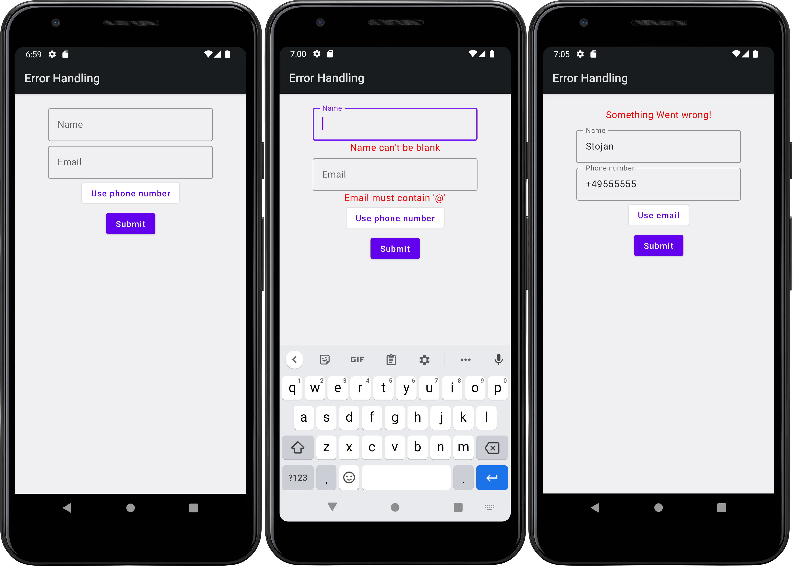
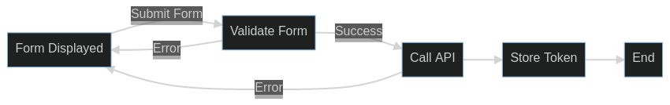
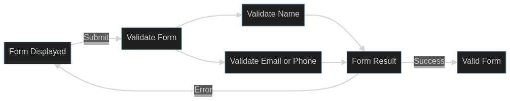

### Error Handling Beyond the Standard Library

#### Stojan Anastasov

@s_anastasov

<br/>

 <!-- .element width="42%" -->

---

## Agenda

- Problem description
- The happy path
- Error handling in Kotlin
- Split the problem into 2
- Accumulating errors
- Failing fast

Note: Learn about Validated and Either from Arrow and what problems do they solve.

---

## Problem description

We are building an app and need a sign up form. Users provide:

- their **name**
- one of **email** OR **phone number**

>--

## Screenshot

 <!-- .element width="20%" -->

>--

## The Happy Path


>--

## Data Layer

```kotlin
@Serializable
data class SignUpBody(
  val name: String,
  val email: String?,
  val phoneNumber: String?,
)

@Serializable
data class SignUpResult(val token: String)
```

```kotlin
// For Retrofit 
interface SignUp {

  @POST("/signup")
  suspend fun signUp(@Body body: SignUpBody): SignUpResult 
}
```
<!-- .element: class="fragment" data-fragment-index="1" -->

Note: DTOs for request/response. KotlinX Serialization. Retrofit interface with suspend support

>--

## Presentation Layer


```kotlin
enum class IdType { EMAIL, PHONE }

data class FormField(val value: String, val error: String?)

data class ViewState(
  val showProgress: Boolean = false,
  val error: String? = null,
  val idType: IdType = IdType.EMAIL,
  val name: FormField = FormField(""),
  val id: FormField, = FormField("")
)
```

This is the model that Compose will render.

>--

## Presentation Layer

```kotlin
val signUp: SignUp // Injected

val state = MutableStateFlow(ViewState())

fun onSubmit(name: String, id: String) {
  val body = createBody(name, id, state.value.idType)

  state.update { it.copy(showProgress = true) }

  viewModelScope.launch {
    val token = signUp.signUp(body)
    storeToken(token)
    // TODO: navigate to success
  }
}
```

Note: This code works, sometimes!

---

## What could go wrong

- Form is empty <!-- .element: class="fragment" data-fragment-index="1" -->
- Invalid data (name, email or phone) <!-- .element: class="fragment" data-fragment-index="2" -->
- Network issues <!-- .element: class="fragment" data-fragment-index="3" -->
- HTTP Errors (duplicate data, server down) <!-- .element: class="fragment" data-fragment-index="4" -->
- Retrofit misconfigured <!-- .element: class="fragment" data-fragment-index="5" -->
- JSON exceptions <!-- .element: class="fragment" data-fragment-index="6" -->
- OutOfMemoryException <!-- .element: class="fragment" data-fragment-index="7" -->
- ... <!-- .element: class="fragment" data-fragment-index="8" -->

>--

### Additional requirements

- **Validate** data before submitting
- Backend also validates data
- Help the users fix the errors
  - When possible show errors close to the problem

>--

## Screenshot

 <!-- .element width="70%" -->

Note: middle - form with errors - local validation or 4XX. <br/>right - generic error, e.g. network error or 5XX

---

## Dealing with failure

There is an input value for which a function can't compute an output

```kotlin
"stojan".toInt()
// fails because 'stojan' is not a number
```

Failure because of external reason
<!-- .element: class="fragment" data-fragment-index="1" -->

```kotlin
signUp.signUp(body)
// can fail if network is down
```
<!-- .element: class="fragment" data-fragment-index="1" -->

>--

### Kotlin and failures

 <!-- .element width="30%" -->

https://elizarov.medium.com/kotlin-and-exceptions-8062f589d07

>--

## Dealing with failure

- Sentinel values
- (Checked) Exceptions
- Nullable types
- Sealed classes
- Move the problem (not in the blog post)

>--

## Sentinel Values

Popular in C (no exceptions)

```c 
file = fopen("file.txt", "r");
if (file == NULL) {
    // handle error & return
}
// work with file, check for error after each file operation
```

- Tedious <!-- .element: class="fragment" data-fragment-index="1" -->
- Easy to forget <!-- .element: class="fragment" data-fragment-index="1" -->
- Hard to debug <!-- .element: class="fragment" data-fragment-index="1" --> 

Note: C doesn't have null safety

>-- 

## Exceptions

Java introduced checked exceptions

```kotlin
val file = FileInputStream("file.txt"); // throws IOException
```

Improvement over sentinel values, but have their own problems. <!-- .element: class="fragment" data-fragment-index="1" -->

>--

### Problems with Exceptions 

- Exceptions that never happen declared as checked <!-- .element: class="fragment" data-fragment-index="1" -->
- APIs with long exception lists <!-- .element: class="fragment" data-fragment-index="2" -->
- Developers catch and ignore exceptions <!-- .element: class="fragment" data-fragment-index="3" -->
- Checked exceptions don't work well with HOF <!-- .element: class="fragment" data-fragment-index="4" -->
- Fatal VS expected can depend on the client <!-- .element: class="fragment" data-fragment-index="5" -->

>--

## Exceptions in Kotlin

- Kotlin does NOT have checked exceptions
- Exceptions are used for logic errors

```kotlin
/** Updates order [quanity], must be positive. */
fun updateOrderQuanity(orderId: OrderId, quantity: Int) {
    require(quantity > 0) { "Quantity must be positive" }
    // proceed with update
}
```
<!-- .element: class="fragment" data-fragment-index="1" -->

>--

## Exceptions in Kotlin

> "Use exceptions for **logic errors**, type-safe results for everything else. Don't use exceptions as a work-around to sneak a result value out of a function." - Roman Elizarov

>--

## Nullable Values

The Kotlin standard library provides some dual-use APIs e.g.

```kotlin
val number: Int = "42".toInt()
// x = 42
```

Useful for constants in the code

```kotlin
val input = getUserInput() // "stojan"
val number: Int? = input.toIntOrNull()
// null
```
<!-- .element: class="fragment" data-fragment-index="1" -->

Works well for dynamic values e.g. user input. <!-- .element: class="fragment" data-fragment-index="1" -->

>--

## Sealed classes

```kotlin
sealed class ParsedDate {
    data class Success(val date: Date) : ParsedDate()
    data class Failure(val errorOffset: Int) : ParsedDate()
}

fun DateFormat.tryParse(text: String): ParsedDate =
    try {
        ParsedDate.Success(parse(text))
    } catch (e: ParseException) {
        ParsedDate.Failure(e.errorOffset)
    }
```

- Works for multiple/different failures <!-- .element: class="fragment" data-fragment-index="1" -->
- Can provide additional data <!-- .element: class="fragment" data-fragment-index="1" -->

Note: Nullable and Sealed modify the output, pushing the problem down the call chain

---

## Move the problem

```kotlin
fun validateEmail(email: String): Boolean = TODO()

fun signUp(email: String) {
  require(validateEmail(email)) { "Invalid email" }
  TODO()
}
```

```kotlin
fun resetPassword(email: String) {
  require(validateEmail(email)) { "Invalid email" }
  TODO()
}
```
<!-- .element: class="fragment" data-fragment-index="1" -->

Note: callers of `signUp` still need to use `validatedEmail`, `require` is just a backup. <br/> write tests <br/> Nullable and Sealed modify the output, this works with the input

>--

## Move the problem

```kotlin
@JvmInline 
value class Email private constructor(val value: String) {

  companion object {

    fun create(value: String): Email? =
      if (value.contains('@')) Email(value)
      else null
  }
}
```

```kotlin
fun signUp(email: Email) = TODO()

fun resetPassword(email: Email) = TODO()
```
<!-- .element: class="fragment" data-fragment-index="1" -->

Note: `signUp()`, `resetPassword()` and any other function using `Email` no longer has to validate it. 

---

## Building the App

>--

## Domain Layer

```kotlin
sealed interface SignUpId

@JvmInline
value class Email(val value: String) : SignUpId

@JvmInline
value class PhoneNumber(val value: String) : SignUpId
```

```kotlin
data class SignUpData(val name: String, val signUpId: SignUpId)
```
<!-- .element: class="fragment" data-fragment-index="1" -->

```kotlin
@JvmInline
value class Token(val value: String)
```
<!-- .element: class="fragment" data-fragment-index="2" -->

Note: Email and PhoneNumber get a wrapper type, name doesn't. There is a trade off. <br/> SignUpId enforces that at least one of Email or PhoneNumber will be there

>--

## Domain Layer

```kotlin
interface UserRepository {

    suspend fun doSignUp(signUpData: SignUpData): Token
}
```

Note: Uses domain types, makes data depend on domain

>--

## Adding error handling



- Two steps that can fail <!-- .element: class="fragment" data-fragment-index="1" -->
- Abort on the first error <!-- .element: class="fragment" data-fragment-index="1" -->

>--

## Form Validation



- Validate data independently <!-- .element: class="fragment" data-fragment-index="1" -->
- Accumulate error <!-- .element: class="fragment" data-fragment-index="1" -->

>--

## Validation Rules

- **Name** can't be blank
- **Email** must contain '@'
- **Phone number** starts with '+'
- **Phone number** is at least 4 characters

Note: these are my arbitrary rules, in your app you might have other

---

## The Validation Problem

#### Accumulating errors

>--

## Nullable Validate

```kotlin
fun validateName(name: String): String? = 
    if (name.isBlank()) null else name

fun validateEmail(email: String): Email? = TODO()
```

```kotlin
fun validatePhone(phone: String): PhoneNumber? = TODO()

fun validateForm(
  name: String, id: String, idType: IdType
): SignUpData?
```
<!-- .element: class="fragment" data-fragment-index="1" -->

Note: we can implement name and phoneNumber <br/> we can NOT implement validatePhone and validateForm

>--

## Nullable Validate

- Nullable types work well for single error
- Nullable types are not a good choice for Form validation

---

## Sealed Validate

```kotlin
sealed class PhoneResult {
  data class Success(val value: String): PhoneResult()
  object NoPlus : PhoneResult()
  object TooShort : PhoneResult()
  object NoPlusAndShort : PhoneResult()
}

fun validatePhone(phone: String): PhoneResult = TODO()
```

>--

## Sealed Validate

```kotlin
sealed class FormResult {
  data class Success(val value: SignUpData): FormResult()
  data class Error(val errors: List<FieldError>): FormResult()
}
```

>--

## Sealed Validate

```kotlin
fun validatePhoneForm(
  name: String, phone: String
): FormResult {
  val validName = validateName(name)
  val validPhone = validatePhone(phone)
  
  return when {
    validName != null && validPhone is Success -> TODO()
    validName == null && validPhone is Success -> TODO()
    validName != null && validPhone is Error -> TODO()
    validName == null && validPhone is Error -> TODO()
    else -> throw IllegalStateException("This never happens")
  }
}
```

Note: similar function exists for email validation.

>--

## Sealed Validate

- Support for multiple/different errors
- Smart cast works, but not great
- Doesn't scale well with parameter count

---

## Arrow

- **Core** - Functional companion to Kotlin's Standard Library
- **Fx** - Functional Effects
- **Optics** - Deep access and transformations over immutable data
- **Analysis** - Pre-, post-condition and invariant checks for kotlin

Note: in this talk we only talk about Core

>--

## Accumulating Errors

```kotlin
sealed class Validated<out E, out A> {
  data class Valid<out A>(val value: A): Validated<Nothing, A>()
  data class Invalid<out E>(val value: E): Validated<E, Nothing>()
}
```

```kotlin
fun validatePhone(value: String): Validated<String, PhoneNumber> =
  if (value.startsWith('+')) PhoneNumber(value).valid()
  else "Phone number must start with '+'".invalid()
```
<!-- .element: class="fragment" data-fragment-index="1" -->

>--

## Accumulating Errors

```kotlin
validatePhone("")
// Invalid(value=Phone number must start with '+')

validatePhone("+49555555")
// Valid(value=PhoneNumber(+49555555))
```

Note: we still have only one error

>--

## Accumulating Errors

```kotlin
NonEmptyList<A> // or Nel<A>
```

```kotlin
val nel: Nel<Int> = nonEmptyListOf(1, 2, 3)
// [1, 2, 3]

val list = listOf(1, 2, 3)
val nelOpt: Option<Nel<Int>> = Nel.fromList(list)
// Option.Some([1, 2, 3])
```
<!-- .element: class="fragment" data-fragment-index="1" -->

Note: `nonEmptyListOf()` requires at least one element. `fromList` forces handling of the failure. 

>--

## Accumulating Errors

```kotlin
typealias ValidatedNel<E, A> = Validated<Nel<E>, A>
```

```kotlin
// Validating a Phone Number
fun validateStart(
  value: String
): ValidatedNel<String, String> =
  if (value.startsWith('+')) value.valid()
  else "Phone number must start with '+'".invalidNel()
```

```kotlin
fun validateLength(
  value: String
): ValidatedNel<String, String> =
  if (value.length > 4) value.valid()
  else "Phone number must be at least 4 chars".invalidNel()
```
<!-- .element: class="fragment" data-fragment-index="1" -->

>--

## Accumulating Errors

```kotlin
fun create(value: String): ValidatedNel<String, PhoneNumber> {
  // ValidatedNel<String, String>
  val start = validateStart(value)
  // // ValidatedNel<String, String>
  val length = validateLength(value) 
  return start.zip(length) { _, phone -> PhoneNumber(phone) }
}
```

```kotlin
PhoneNumber.create("")
// Invalid(Nel["Must start with '+'", "Must be at least 4 chars"])

PhoneNumber.create("+49555555")
// Valid(value=PhoneNumber(+49555555))
```
<!-- .element: class="fragment" data-fragment-index="1" -->

Note: zip executes the lambda ONLY if both are Valid. <br/> in case of invalid, it merges the errors (the errors are a List so merging is creating a new list with elements of both)

---

## Validated Form

Domain model for the error

```kotlin
enum class FormFieldName {
    NAME, EMAIL, PHONE_NUMBER
}

data class FormFieldError(
  val formFieldName: FormFieldName, 
  val errors: Nel<String>
)

typealias FormValidationRes<A> = ValidatedNel<FormFieldError, A>
```

>--

## Validated Form

```kotlin
fun validateName(name: String): String? = 
  name.ifBlank { null }
```

```kotlin
@JvmInline
value class Email private constructor(val value: String) {

    companion object {

        fun create(value: String): Email? =
            if (value.contains('@')) Email(value)
            else null
    }
}
```
<!-- .element: class="fragment" data-fragment-index="1" -->

Note: name - single error, nullable strategy

>--

## Validated Form

```kotlin
@JvmInline
value class PhoneNumber private constructor(val value: String) {

  companion object {

    fun create(value: String): ValidationRes<PhoneNumber> {
      val start = start(value)
      val length = length(value)
      return start.zip(length) { _, pn -> PhoneNumber(pn) }
    }

    private fun start(value: String): ValidationRes<String> =
        if (value.startsWith('+')) value.valid()
        else "Phone number must start with '+'".invalidNel()

    private fun length(value: String): ValidationRes<String> =
        if (value.length > 4) value.valid()
        else "Phone number must be at least 4 chars".invalidNel()
  }
}
```

Note: Multiple errors, switch to Validated

>--

## Validated <3 Kotlin

```kotlin
val validName = Validated.fromNullable(validateName(name)) {
    "Name can't be blank"
  }
val validPhone = PhoneNumber.create(phoneNumber)

validName.zip(validPhone) { name, phone -> TODO() }
```

>--

## Validated Form

```kotlin
fun SignUpData.createEmail(
  name: String, email: String
): FormValidationRes<SignUpData> {
  val nameOrNull = validateName(name)
  val validatedName = Validated.fromNullable(nameOrNull) {
      "Name can't be blank"
  }.mapLeft { FormFieldError(NAME, it.nel()).nel() }

  val emailOrNull = Email.create(email)
  val validatedEmail = Validated.fromNullable(emailOrNull) {
      "Email must contain '@'"
  }.mapLeft { FormFieldError(EMAIL, it.nel()).nel() }

  return validatedName.zip(validatedEmail, ::SignUpData)
}
```

Note: Use nullable for single error, Validated when we need more

>--

## Validated Form

```kotlin
val signUpData = SignUpData.createEmail(
  "Stojan", 
  "stojan@gmail.com"
)
//Valid(SignUpData(name=Stojan,signUpId=Email(stojan@gmail.com)))
```

---

## Fail Fast Problem


>--

## Nullable Submit

```kotlin
// Won't work, different kinds of error

interface UserRepository {

    suspend fun doSignUp(signUpData: SignUpData): Token?
}
```

```kotlin
// Won't work, might need more than 1 error

fun validateForm(
  name: String, id: String, idType: IdType
): SignUpData? = TODO()
```

<!-- .element: class="fragment" data-fragment-index="1" -->

The compiler will make sure errors are handled
<!-- .element: class="fragment" data-fragment-index="2" -->

Note: doesn't work with current requirements, if you have different requirements it might work

>--

## Sealed Submit

```kotlin
data class FieldErrorDto(
  val name: String,
  val error: String
)
```

```kotlin
sealed class DoSignUpResult {
  data class Success(token: String): DoSignUpResult()
  data class HttpError(
    val msg: String, 
    val errors: List<FieldErrorDto>
  )
  object NetworkError: DoSignUpResult()
}
```
<!-- .element: class="fragment" data-fragment-index="1" -->

>--

## Sealed Submit

```kotlin
// SignUpRepository
val signUp: SignUp // Injected

suspend fun doSignUp(body: SignUpBody): DoSignUpResult = 
  try {
    val result = doSignUp(body)
    Success(result.token)
  } catch (e: HttpException) {
    e.toHttpError() // boring code inside
  } catch (e: IOException) {
    NetworkError
  }
```
>--

## Sealed Submit

```kotlin
sealed class FormResult {
  data class Success(val body: SignUpData): FormResult()
  data class Error(val errors: List<FieldError>): FormResult()
}

fun validateForm(
  name: String, id: String, idType: IdType
): FormResult = TODO()
```

We saw how we could implement this

>--

## Sealed Submit

```kotlin
// ViewModel
val repo: SignUpRepo // injected

val state = MutableStateFlow(ViewState())

fun onSubmit(name: String, id: String) {
  state.update { it.copy(showProgress = true) }

  val body = validateForm(name, id, state.value.idType)

  if (body is FormResult.Success) {
    viewModelScope.launch {
      val result = repo.doSignUp(body) // Smart cast
      when (result) {
        is DoSignUpResult.Success -> // TODO: success
        is DoSignUpResult.HttpError -> 
          state.update { it.copy(error = result.msg) }
        DoSignUpResult.NetworkError ->
          state.update { it.copy(error = "Please check your connection") }
      }
    }
  } else {
    // or do more complex error processing
    state.update { it.copy(error = errors.first()) }
  }
}
```

Note: with more steps we might end up with the pyramid of doom

>--

## Sealed Submit

- Support for better error messages
- Doesn't scale well with number of steps
  - Risk of pyramid of doom

>--

## Sealed Submit

```kotlin
val x = doX()
if (x is Success) {
    val y = doY(x)
    if (y is Success) {
       val z = doZ(y) 
       if (z is Success) {
         // ....
       }
    }
}
```

Note: there is a pattern here

---

## Failing Fast with Arrow

>--

## Failing Fast

```kotlin
sealed class Either<out A, out B> {
  data class Left<out A>(val value: A): Either<A, Nothing>()
  data class Right<out B>(val value: B): Either<Nothing, B>()
}
```

```kotlin
val right = "5".right()
// Right(value=5)

val left = "Something went wrong".left()
// Left(value="Something went wrong")
```
<!-- .element: class="fragment" data-fragment-index="1" -->

>--

## Failing Fast

```kotlin
fun validateForm(
  name: String, 
  id: String
): Either<List<FormError>, SignUpData> = TODO()

fun submitForm(
  data: SignUpData
): Either<List<FormError>>, Token> = TODO()
```

Note: the input of the second function matches the right side of the output of the first

>--

## Failing Fast

```kotlin
val signUpData = validateForm("stojan", "stojan@gmail.com")

if (signUpData is Right) {
  val token = submitForm(signUpData.value) {
    if (token is Right) {
      // TODO: store token.value
    }
  }
}
```

Note: Either is a sealed class so this also works, but suffers from the same problem.

>--

## Failing Fast

```kotlin
either<List<FormError>, Token> {
  // Either<List<FormError>, SignUpData>
  val formData: SignUpData = validateForm(
    "stojan", 
    "stojan@gmail.com"
  ).bind()
  // Either<List<FormError>>, Token>
  val token: Token = submitForm(formData).bind()
  token
}
// Right(value=myToken)
```

Note: this is syntax sugar for the code from the previous slide <br/> bind() is only accessible in the either block <br/> each bind() will continue in case of Right - otherwise short circuit

>--

## Failing Fast

```kotlin
either<List<FormError>, Token> {
  val formData: SignUpData = validateForm("", "").bind()
  val token = submitForm(formData).bind()
  token
}
// Left(value=["Name can't be empty", "Email must contain '@'"])
```

Note: submitForm is NOT executed here

---

## Submit Form

```kotlin
@Serializable data class FormFieldDto(
  val field: String, 
  val errors: List<String>
)

@Serializable data class SignUpErrorDto(
    val message: String,
    val errors: List<FormFieldDto>
)
```

```kotlin
@POST("/signup")
suspend fun signUp(
  body: SignUpBody
): Either<SignUpErrorDto, SignUpResult>
```
<!-- .element: class="fragment" data-fragment-index="1" -->

Note: arrow has built in support for Retrofit with Either. It handles HTTP errors

>--

## Submit Form

```kotlin
interface UserRepository {

  suspend fun doSignUp(
    signUpData: SignUpData
  ): Either<SignUpError, Token>
}

sealed class SignUpError {
    data class ValidationError(
      val errors: Nel<FormFieldError>
    ): SignUpError()
    data class HttpError(val message: String): SignUpError()
    data class IOError(val e: IOException): SignUpError()
}
```

>--

## Submit Form

```kotlin
// UserRepository
override suspend fun doSignUp(
    signUpData: SignUpData
): Either<SignUpError, Token> = either {
  val body = signUpData.toBody()
  val result = try {
      signUp.signUp(body)
          .mapLeft { it.toDomainError() }
  } catch (t: IOException) {
      SignUpError.IOError(t).left()
  }.bind()
  Token(result.token)
}
```

>--

## Submit Form

```kotlin
// ViewModel
private fun validateForm(
  name: String,
  id: String,
  viewState: ViewState
): Either<ViewState, SignUpData> {  
  val signUpData = when (viewState.idType) {
    IdType.EMAIL -> SignUpData.createEmail(name, id)
    IdType.PHONE -> SignUpData.createPhone(name, id)
  }.mapLeft { viewState.withErrors(it) }
  
  return signUpData.toEither()
}
```

Note: Convert to Either to chain it with Repo call

>--

## Submit Form

```kotlin
// ViewModel
private suspend fun signUpUser(
  name: String,
  id: String,
): Either<ViewState, Unit> = either {
  state.update { it.clearErrors().copy(showProgress = true) }
  val signUpData = validateForm(name, id, state.value).bind()
  userRepository.doSignUp(signUpData)
      .mapLeft { state.value.withError(it) }
      .bind()
  Unit
}
```

>--

## Submit Form

```kotlin
// ViewModel
fun onSubmit(name: String, id: String) {
  viewModelScope.launch {
    signUpUser(name, id)
      .fold(
        { state.value = it }, 
        { /* TODO: navigate to Home */ }
      )
  }
}
```

---

## Error Handling

- Exceptions - logic errors
- Nullable types - single failure, in the small
- Sealed types  
  - multiple failures
  - failing fast
  - across boundaries

>--

## Error Handling

- `Validated<E, A>` - accumulating errors using `zip`
  - Focus on the happy path, arrow handles accumulating errors
- `Either<A, B>` - multiple failures, across boundaries
  - `either {}` solves the pyramid of doom problem

---

## The End

Thank you for your attention

@s_anastasov